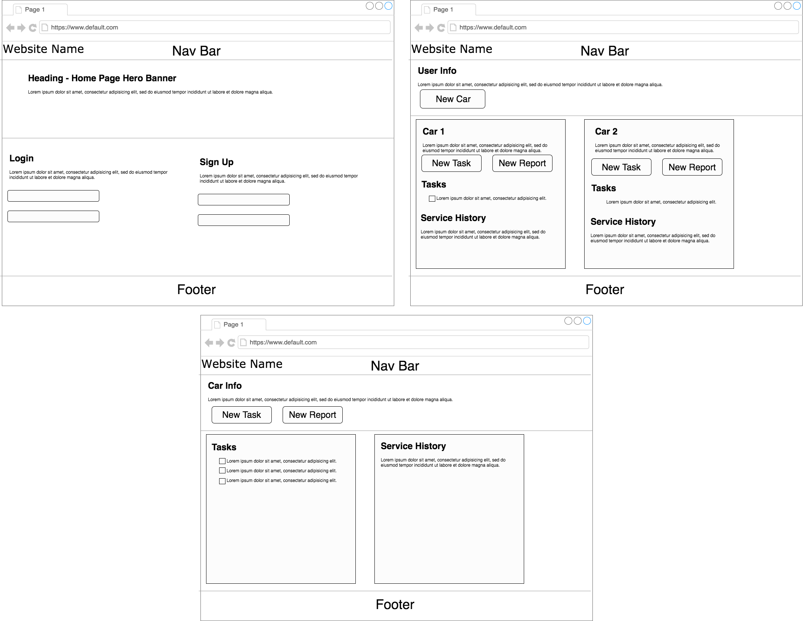
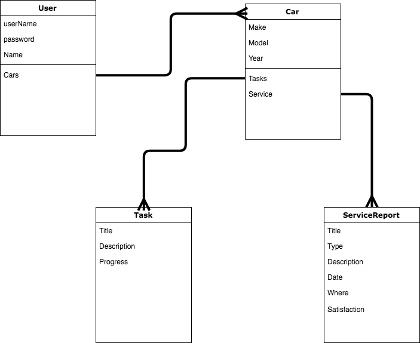

# WDI_Project_3
Car Service History App
---
---
### Project: CarLog
### Heroku Link: [Heroku App](https://mears-car-service.herokuapp.com/)
### Trello Board: [WDI Project 3](https://trello.com/b/aDd1W78I/project-3)
### Technologies Used:
Javascript, HTML, Css. Built with MERN stack
---
### Goal (v1):
---
Create an app that allow a user to track the history of the service done on their car as well as keep up to date on future task that they might need to accomplish for their car. The app will allow user to add multiple cars to their account. A Reach goal is to include an api that allows the user to keep track of the cars maintance schedule as well as get notifications with in the app about when they have a maintance task comming up.
---
### Wireframes

---
### ERD:

